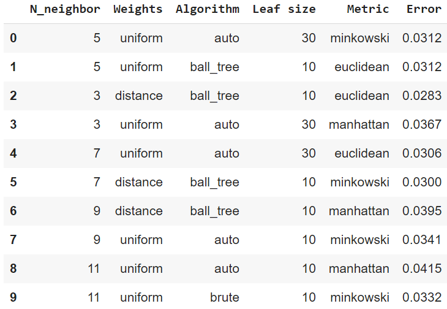
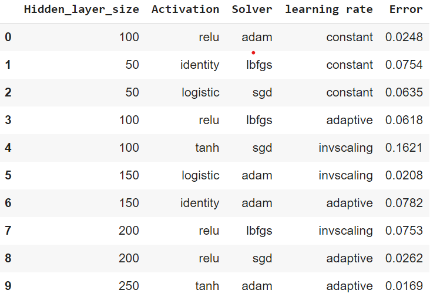

# Implementation of different Classifiers - KNN, SVM, MLP

For this part I did the following steps:
- Downloaded the required dataset and split it into train and test datasets.
- Ran the above mentioned classifiers one by one, trying different parameters.
- Discarded many parameters due to time constraints.
- Stored the results in a dataframe for better visualization.

Following are the details regarding the various parameters used along with their respective error rates.

KNN

Here the best error rate is in index 2

MLP

Here the best error rate is in index 9

SVM
[SVM result](https://github.com/Harshil2001/Neural-Networks-K-nearest-neighbors-and-SVMs/blob/main/img/svm%20results.png)

Here the best error rate is in index 0

Note: The errors in part 2 are calculated by :- (1 - accuracy)

The best error rates for the 3 classifiers that I found are:
- SVM - 0.0204
- MLP - 0.0169
- KNN - 0.0283
